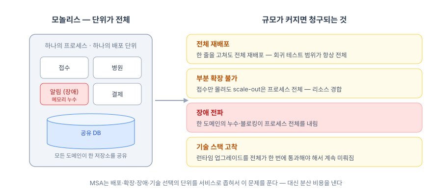
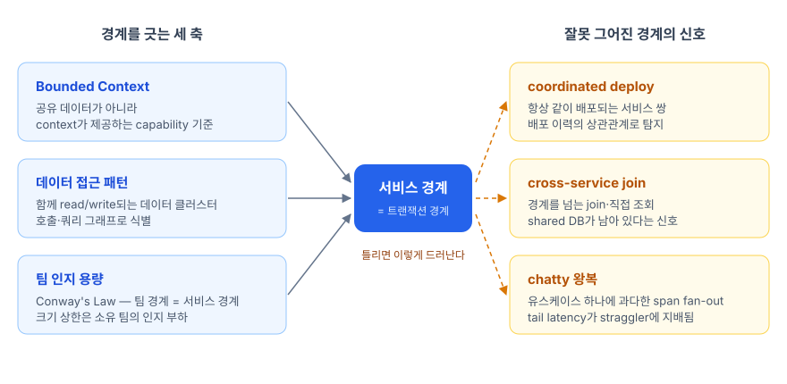
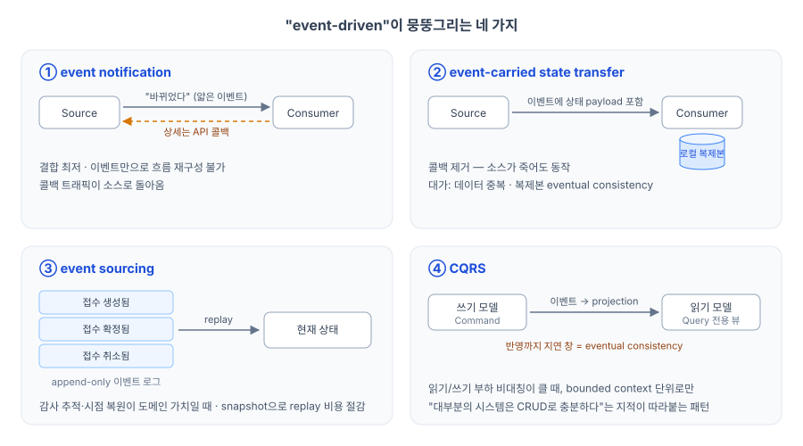
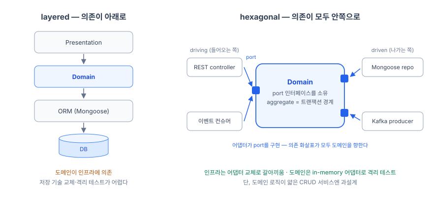
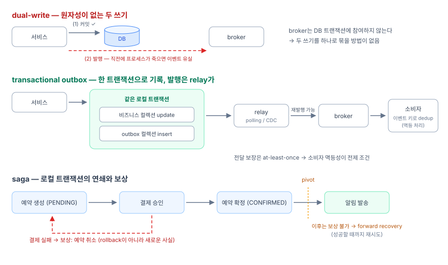
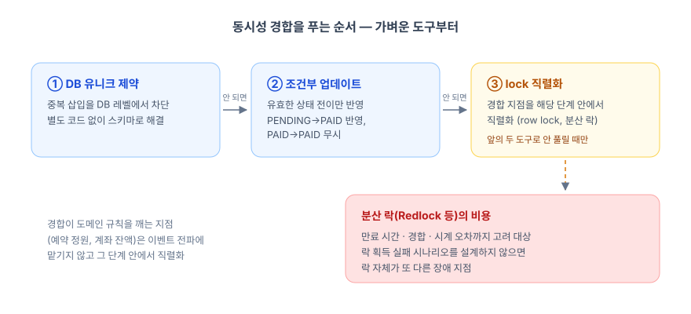
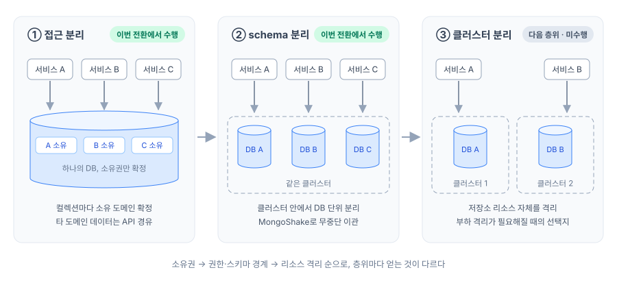
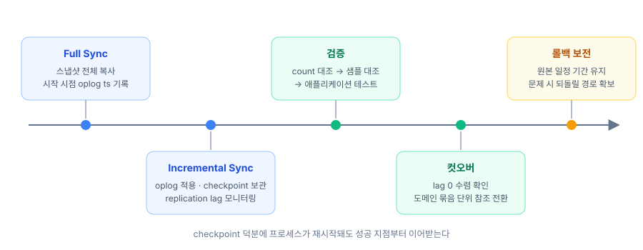

# MSA - 원칙, 아키텍처, 그리고 DB 분리

안녕하세요. 비브로스에서 백엔드 개발을 담당하고 있는 박진아입니다.

MSA 전환을 진행하며 정리한 내용을 한 편으로 묶었습니다. 핵심은 7장입니다. 단일 DB에 모여 있던 104개 컬렉션을 무중단으로 도메인별 DB 6개로 분리한 과정을 다룹니다. 앞의 여섯 장은 그 작업의 바탕이 된 이론을 정리합니다 - 왜 MSA인가에서 출발해 원칙, 서비스 경계, 아키텍처 유형, 통신·resilience 패턴, 데이터 일관성 순서입니다.

<!-- truncate -->

1. [왜 MSA인가 - 모놀리스의 기술적 한계](#1-왜-msa인가---모놀리스의-기술적-한계)
2. [MSA의 핵심 원칙](#2-msa의-핵심-원칙)
3. [서비스 경계 정하는 법](#3-서비스-경계-정하는-법)
4. [MSA 아키텍처 유형](#4-msa-아키텍처-유형)
5. [지원 패턴 - 통신과 resilience](#5-지원-패턴---통신과-resilience)
6. [데이터 일관성 - dual-write, outbox, saga](#6-데이터-일관성---dual-write-outbox-saga)
7. [DB 분리 실전](#7-db-분리-실전)
8. [마치며](#8-마치며)

## 1. 왜 MSA인가 - 모놀리스의 기술적 한계

모놀리스는 처음에는 가장 빠른 구조입니다. 함수 호출은 네트워크에서 실패하지 않고 트랜잭션은 로컬이고 디버깅은 스택트레이스 하나로 끝납니다. 한계는 코드베이스와 트래픽이 일정 규모를 넘어서면 네 가지로 나타납니다.

- **전체 재배포** - 한 줄을 고쳐도 전체를 다시 배포합니다. 회귀 테스트 범위가 항상 전체이고 릴리즈 주기는 가장 느린 도메인에 묶입니다(release train).
- **부분 확장 불가** - 특정 도메인에만 트래픽이 몰려도 scale-out은 프로세스 전체 단위입니다. Node.js라면 더 직접적입니다 - 무거운 동기 연산 하나가 이벤트 루프를 잡는 순간 도메인과 무관하게 모든 요청이 대기합니다.
- **장애 전파** - 한 도메인의 메모리 누수, 커넥션 풀 고갈, 무한 루프가 프로세스 전체를 내립니다. 장애의 단위가 곧 시스템 전체입니다.
- **기술 스택 고착** - 런타임 업그레이드는 전체 코드가 한 번에 통과해야 해서 계속 미뤄지고, Node v12로 시작한 서버가 몇 년 뒤에도 v12 호환 코드에 묶이게 됩니다.

MSA는 배포·확장·장애·기술 선택의 단위를 서비스로 좁혀서 이 한계를 풉니다. 대신 분산 시스템의 비용을 지불합니다 - 함수 호출이 네트워크 호출이 되고 로컬 트랜잭션이 분산 트랜잭션 문제가 되고 운영해야 할 대상이 늘어납니다. 이 글의 나머지는 그 비용이 어디서 청구되는지, 각 지점의 표준 해법이 무엇인지를 다룹니다.



## 2. MSA의 핵심 원칙

원칙은 다섯 개로 정리됩니다.

- **도메인 소유권** - 서비스는 기능 조각이 아니라 도메인의 소유자입니다. 그 도메인의 데이터, 비즈니스 규칙, API가 한 서비스(그리고 한 팀)의 소유가 됩니다.
- **database-per-service** - 서비스는 자기 데이터 저장소를 소유하고, 다른 서비스는 API나 이벤트로만 접근합니다. 여러 서비스가 한 DB를 공유하면(shared-database anti-pattern) 스키마가 암묵적인 공용 계약이 되고, 독립 배포가 무너지는 첫 번째 지점이 대부분 여기입니다.
- **느슨한 결합, 높은 응집** - 함께 바뀌는 것은 한 서비스 안에 두고 서비스 사이에는 명시적인 계약 - API 스키마, 이벤트 스키마 - 만 남깁니다.
- **독립 배포 가능성** - 다른 서비스와 일정을 조율하지 않고 배포할 수 있는가. 경계가 맞는지 확인하는 가장 실용적인 리트머스 시험지입니다. 항상 함께 배포되는 서비스 쌍이 있다면 그 둘은 사실상 하나입니다.
- **장애 격리** - 한 서비스의 장애가 호출 체인을 타고 전체로 번지지 않도록 경계마다 방어를 둡니다. 타임아웃, circuit breaker, 비동기 경계가 그 도구이고 5장에서 다룹니다.

다섯 원칙은 결국 하나의 질문으로 수렴합니다 - 어디에 경계를 그을 것인가.

## 3. 서비스 경계 정하는 법

경계를 정하는 기준으로 세 가지가 쓰입니다.

**bounded context - capability 기준**

DDD의 bounded context는 하나의 도메인 모델이 일관되게 통하는 범위입니다. 기준은 어떤 데이터를 공유하느냐가 아니라 그 context가 무엇을 책임지느냐입니다. 같은 "병원"이라는 단어도 접수 context에서는 대기열과 접수 가능 여부를 가진 접수처고, 검색 context에서는 위치와 진료과목을 가진 검색 대상입니다. 두 모델을 억지로 합치면 필드 수십 개짜리 만능 모델이 생기고 그 모델의 변경은 모든 사용처에 파급됩니다. 같은 단어가 다른 모델을 가리키기 시작하는 지점, 즉 ubiquitous language가 깨지는 지점이 context의 경계입니다.

**데이터 접근 패턴**

같이 읽히고 같이 쓰이는 데이터는 같은 서비스에 둡니다. 모놀리스에 이미 답이 있습니다. 모듈별 모델 의존 그래프를 뽑고 한 요청 안에서 함께 조회되는 컬렉션 집합을 APM으로 집계하고 하나의 트랜잭션으로 묶이는 컬렉션들을 찾습니다. 이렇게 나온 응집 클러스터를 가로지르는 경계는 그 트랜잭션을 분산 트랜잭션으로 만들겠다는 선언과 같습니다.

**팀 - 인지 부하의 상한**

Conway's Law대로 시스템 구조는 조직의 커뮤니케이션 구조를 닮아갑니다. 이걸 역으로 이용해 원하는 아키텍처에 맞게 팀을 먼저 재편하는 것이 inverse Conway maneuver입니다. Team Topologies는 실용적인 상한을 하나 제시합니다 - 서비스의 크기와 수는 소유 팀의 인지 부하를 넘으면 안 됩니다. 다섯 명이 서비스 마흔 개를 운영하고 있다면 기술 이전에 경계 설정이 잘못됐습니다.

경계가 애매할 때는 크게 시작해서 필요할 때 자르는 쪽이 안전합니다. 서비스가 하나 늘 때마다 네트워크 경계, 배포 파이프라인, 모니터링 대상이 같이 늘어나고 나눈 것을 다시 합치는 일은 큰 것을 자르는 일보다 훨씬 어렵기 때문입니다.

**잘못 그은 경계가 보내는 신호**

경계가 틀렸을 때의 증상은 뚜렷합니다. 항상 같이 배포되는 서비스 쌍(coordinated deploy), 여러 서비스가 직접 읽고 쓰는 공유 DB, 유스케이스 하나가 서비스 서너 개를 동기로 왕복하는 chatty 통신. 셋 중 하나라도 보이면 물리적으로만 분리된 distributed monolith입니다. chatty 왕복은 tail latency로도 대가를 치릅니다 - fan-out이 넓을수록 가장 느린 응답 하나가 p99를 지배합니다(The Tail at Scale).

다행히 경계 품질은 측정할 수 있습니다. distributed tracing에서 유스케이스별 span 팬아웃을 집계하면 chatty한 경계가 드러나고 배포 이력의 상관관계를 보면 숨은 coordinated deploy가 드러나고 DB 계정 권한을 감사하면 경계를 넘는 직접 조회가 드러납니다. bounded context는 한 번 정하면 끝이 아니라 이런 데이터를 보고 다시 그리는 대상입니다.



## 4. MSA 아키텍처 유형

경계를 그었다면 서비스들을 엮는 방식을 골라야 합니다. 시스템 수준의 유형부터 봅니다.

### event-driven - 한 단어에 뭉뚱그려진 네 패턴

"event-driven"은 서로 다른 네 가지를 가리키는 말로 쓰입니다. 가장 널리 인용되는 구분을 기준으로 정리합니다.

**event notification**은 "바뀌었다"는 사실만 담은 얇은 이벤트를 발행합니다. 수신자는 상세가 필요하면 소스 서비스의 API를 다시 호출합니다. 결합이 가장 낮은 대신 이벤트 로그만으로는 전체 흐름을 재구성할 수 없고 그 조회 트래픽이 소스로 돌아옵니다.

**event-carried state transfer**는 이벤트에 수신자가 필요로 하는 데이터를 실어 보냅니다. 수신자는 자기 저장소에 로컬 복제본을 유지하므로 소스를 다시 호출할 일이 사라지고 소스 서비스가 죽어 있어도 동작합니다. 대가는 데이터 중복과 복제본의 eventual consistency입니다.

**event sourcing**은 상태의 현재값 대신 상태를 바꾼 이벤트 전체를 append-only 로그로 저장합니다. 현재 상태는 이벤트를 재생(replay)해서 얻고 재생 비용은 주기적인 snapshot으로 줄입니다. 모든 변경의 감사 추적과 임의 시점 복원이 공짜로 따라오므로 이력 자체가 도메인 가치인 곳 - 금융 원장, 예약 상태 전이 - 에 맞습니다. 반면 이벤트 스키마가 아직 자주 바뀌는 초기 도메인에서는 과거 이벤트를 새 스키마로 계속 끌고 가는 비용이 이득을 넘어섭니다.

**CQRS**는 쓰기 모델과 읽기 모델을 분리합니다. 같은 DB 안에서 모델만 나누는 가벼운 형태부터 쓰기 측의 변경 이벤트를 구독해 조회 전용 저장소에 비정규화된 뷰를 만들어 두는(projection) 형태까지 스펙트럼이 있습니다. 어느 쪽이든 쓰기가 읽기 모델에 반영되기까지 시차가 생기므로 그 eventual consistency를 도메인이 감당할 수 있을 때 씁니다. 대부분의 시스템은 CRUD로 충분하다는 지적이 늘 따라붙는 패턴이기도 합니다.

네 패턴은 함께 쓰이는 일이 많지만 - event sourcing의 로그를 CQRS projection의 소스로 쓰는 식으로 - 지금 어느 것을 쓰고 있는지 구분하지 못하면 설계 논의가 서로 다른 것을 가리키며 겉돕니다.



### 격리와 조직화의 유형들

**cell-based architecture**는 compute·storage·설정을 cell 하나로 묶고 전체 스택을 키우는 대신 cell을 복제해 확장합니다. 장애의 폭발 반경(blast radius)이 cell 하나로 제한되고 완전히 죽지는 않았는데 느려지는 gray failure에서 문제 cell의 트래픽만 빼낼 수 있습니다. AZ 단위로 cell을 구성해 장애 격리와 cross-AZ 트래픽 비용 절감을 함께 얻은 사례도 있습니다. cell 간 데이터 파티셔닝과 운영 복잡도가 따라오므로 가용성 요구가 그 비용을 정당화할 때의 선택지입니다.

<strong>DOMA(Domain-Oriented Microservice Architecture)</strong>는 서비스가 너무 많아졌을 때의 조직화 방법입니다. 서비스 수가 수백 개를 넘어가면 장애 하나를 추적하는 데도 여러 팀의 서비스 수십 개를 살펴야 하는 상황이 오고, 처방은 설계 단위를 서비스에서 도메인으로 올리는 것입니다.

관련 서비스 1~수십 개를 도메인으로 묶고 도메인마다 gateway를 단일 진입점으로 세워 내부 서비스와 테이블을 은닉합니다. 다른 도메인은 gateway만 호출하므로 내부 구현을 전면 교체해도 호출하는 쪽은 바꿀 것이 없습니다 - 서비스는 몇 년 단위로 생기고 사라지기를 반복하므로 이 은닉이 핵심입니다. 여기에 Infrastructure → Business → Product → Presentation → Edge 5계층으로 하위 방향 의존만 허용해 도메인 간 의존을 정리합니다.

### 서비스 내부 - layered vs hexagonal

서비스 하나의 내부 구조는 layered와 hexagonal 계열(hexagonal, onion, clean - 셋은 같은 원리의 변주입니다)로 갈립니다. 실질적인 차이는 의존성의 방향 하나입니다.

layered에서는 도메인 로직이 ORM을 거쳐 DB로 위에서 아래로 의존합니다. 도메인이 인프라에 종속되어 있으므로 저장 기술을 바꾸려면 도메인 코드를 건드려야 하고 도메인 로직만 떼어 테스트하기 어렵습니다.

hexagonal에서는 방향이 뒤집힙니다. 도메인이 "저장한다", "발행한다" 같은 port 인터페이스를 소유하고 Mongoose repository든 Kafka producer든 어댑터가 바깥에서 그 인터페이스를 구현해 연결됩니다. 들어오는 쪽(driving - API 컨트롤러, 이벤트 컨슈머)과 나가는 쪽(driven - DB, MQ, 외부 API)이 대칭으로 정리됩니다. 얻는 것은 인프라 교체의 자유와 repository를 in-memory 구현으로 바꿔 도메인 로직을 네트워크 없이 테스트할 수 있다는 점입니다. 통합 테스트가 비싼 MSA에서 후자의 가치가 큽니다.

DDD의 전술 패턴과 만나는 지점도 여기입니다. aggregate는 불변식을 지키는 일관성 경계이자 로컬 트랜잭션의 단위인데 이것이 그대로 6장에서 다룰 saga의 로컬 트랜잭션 단위, outbox 이벤트의 발행 단위가 됩니다. 다만 이 구조는 인터페이스·어댑터·DTO 매핑이라는 비용을 층층이 요구하므로 도메인 로직이 얇은 CRUD 서비스에 씌우면 보일러플레이트만 남습니다.



유형 전체를 관통하는 원칙이 하나 있습니다. CQRS든 event sourcing이든 cell이든 전역 기본값이 아니라 bounded context 단위로 국소 적용한다는 점입니다. 읽기 부하가 쓰기의 수백 배인 검색 context에 CQRS를 쓰면서 옆의 접수 context는 CRUD로 두는 것이 정상입니다.

## 5. 지원 패턴 - 통신과 resilience

**sync vs async**

통신은 즉답이 필요한가로 가릅니다. 사용자가 응답을 기다리면 sync - REST가 기본값이고 지연·직렬화 비용이 아까운 내부 핫패스는 gRPC입니다. sync의 대가는 가용성 결합입니다. 상대가 죽으면 나도 실패하므로 체인 전체의 가용성은 구간 가용성의 곱이 됩니다. 가용성 99.9%짜리 서비스 세 개가 체인으로 엮이면 전체는 99.7%로 떨어지고 체인이 길수록 곱셈으로 나빠집니다.

즉답이 필요 없고 eventual consistency를 수용할 수 있으면 async 메시징입니다. async는 장애 격리(소비자가 죽어도 메시지는 broker에 남습니다)와 처리량을 주는 대신 요청-응답 상관관계를 없앱니다. 이 요청이 지금 어디까지 처리됐는지 한눈에 볼 수 없게 되고 많은 팀이 결국 correlation ID를 이벤트에 실어 나르는 추적 체계를 따로 만들게 됩니다.

**deadline propagation**

sync 체인에는 시간 예산이 필요합니다. 전체 타임아웃이 1초라면 각 hop이 자기가 쓴 시간을 빼고 남은 예산을 downstream에 넘겨야 합니다. 이것이 없으면 클라이언트가 이미 포기한 요청을 downstream이 끝까지 처리하는 낭비가 쌓입니다.

**API Gateway와 BFF**

Gateway는 라우팅·인증·rate limit 같은 north-south 관심사의 단일 지점입니다. BFF(Backend for Frontend)는 클라이언트별 전용 백엔드로, 여러 서비스 응답을 조합해 화면에 맞게 가공합니다. 주의할 것은 비대화입니다 - aggregation을 넘어 비즈니스 로직이 스며들면 클라이언트 수만큼 복제된 작은 모놀리스가 생기므로, 도메인 규칙은 도메인 서비스에 두고 BFF에는 화면을 위한 조합만 남깁니다.

**service mesh**

mTLS, retry, 트래픽 분배, 관측 같은 통신 관심사를 애플리케이션 코드 밖의 프록시 계층으로 내리는 접근입니다. pod마다 사이드카를 두는 방식에서 리소스 오버헤드를 줄인 노드 단위(ambient) 방식으로 무게중심이 옮겨 갔습니다. 서비스 수가 적을 때는 gateway와 클라이언트 라이브러리로 충분한 경우가 많아 mesh는 east-west 통신 관리가 실질적인 운영 부담으로 드러난 뒤에 도입해도 늦지 않습니다.

**resilience 패턴**

장애 상황에서 재시도는 문제를 증폭합니다. 호출 체인이 3단이고 구간마다 최대 3번씩 시도하면 최하단 장애는 27배 요청으로 돌아옵니다 - 회복하려는 서비스를 재시도 트래픽이 다시 무너뜨리는 retry storm입니다.

방어는 조합입니다. retry budget은 재시도 횟수가 아니라 총량을 정상 트래픽의 10~20%로 제한하고 초과분은 즉시 실패시킵니다. backoff에 jitter를 섞어 실패한 클라이언트들이 같은 시각에 몰려오는 동기화를 깨뜨립니다. circuit breaker는 실패율이 임계치를 넘으면 회로를 열어 호출 자체를 차단하고(Open) 대기 후 시험 요청(Half-Open)이 성공하면 닫습니다(Closed).

그리고 재시도를 붙이기 전에 그 연산이 멱등인지부터 확인해야 합니다 - 결제 요청의 재시도는 이중 결제입니다. 멱등하지 않다면 6장의 idempotency key가 선행돼야 합니다.

## 6. 데이터 일관성 - dual-write, outbox, saga

경계는 트랜잭션을 가릅니다. 모놀리스에서 BEGIN…COMMIT 하나였던 "접수 확정 + 알림 기록"이 접수와 알림 사이에 경계를 긋는 순간 두 저장소에 걸친 문제가 됩니다. MSA에서 가장 정교하게 설계해야 하는 지점이 여기입니다.

**dual-write problem**

"DB에 저장하고 broker에 발행한다"는 흔한 코드에는 두 시스템에 걸친 원자성이 없습니다. 커밋 후 발행 직전에 프로세스가 죽으면 이벤트가 유실되고 - 알림 서비스는 접수 사실을 영영 모릅니다 - 발행을 먼저 하면 커밋 실패 시 일어나지 않은 사실이 전파됩니다. DB 트랜잭션 안에서 발행하면 되지 않느냐는 답은 성립하지 않습니다. broker는 DB 트랜잭션에 참여하지 않기 때문입니다.

**transactional outbox**

표준 해법은 상태 변경과 이벤트를 같은 DB의 같은 로컬 트랜잭션으로 기록하는 것입니다.

```ts
await session.withTransaction(async () => {
  await receptions.updateOne({ _id }, { $set: { status: 'ACCEPTED' } }, { session });
  await outbox.insertOne(
    { eventType: 'reception.accepted', aggregateId: _id, payload, status: 'PENDING' },
    { session },
  );
});
```

이 시점에 원자성은 확보됩니다. 발행은 별도의 relay가 맡습니다 - outbox 테이블을 주기적으로 읽는 polling 방식과 DB의 변경 로그(oplog, binlog)를 구독하는 CDC 방식(Debezium이 대표적)이 있습니다. relay는 실패하면 다시 발행하므로 전달 보장은 at-least-once가 됩니다. exactly-once가 이상적이지만 broker, 소비자, 저장소 전 구간이 함께 보장해야 성립해서 현실적으로 얻기 어렵습니다. 유실을 감수하는 at-most-once는 대부분의 도메인에서 선택지가 아닙니다. 그래서 실무 기본값은 at-least-once입니다. 유실은 없지만 중복이 오므로 소비자 멱등성이 전제 조건이 됩니다.

멱등 처리는 세 갈래입니다.

- **유니크 제약** - 이벤트 고유 키에 유니크 제약을 걸어 중복 삽입을 DB 레벨에서 막습니다.
- **상태 기계 기반 조건부 업데이트** - 유효한 전이만 허용합니다. PENDING→PAID는 반영되고 PAID→PAID는 무시됩니다.
- **처리 이력 기록** - 처리한 이벤트 키를 기록해 두 번째 도착을 걸러냅니다.

어느 쪽이든 같은 메시지가 두 번 와도 결과가 같으면 됩니다.

**saga**

여러 서비스에 걸친 쓰기는 전체를 로컬 트랜잭션의 연쇄로 쪼개고 중간 실패 시 이미 커밋된 단계를 보상 트랜잭션으로 되돌리는 saga로 풉니다. 조율 방식은 두 가지입니다. orchestration은 중앙 orchestrator가 각 단계에 명령을 보내고 응답을 받아 다음 단계나 보상을 지휘합니다. 어느 단계에서 왜 멈췄는지가 한 곳에 모여 관측이 쉬운 대신 orchestrator가 결합점이 됩니다. choreography는 각 서비스가 앞 단계의 이벤트를 구독해 자기 일을 하고 다음 이벤트를 발행합니다. 결합이 낮고 서비스 추가가 쉬운 대신 전역 상태가 어디에도 없어서 이 saga가 지금 어디에 있는지 알려면 여러 서비스의 로그를 이어 붙여야 합니다. 단계가 많고 보상 규칙이 복잡한 핵심 트랜잭션은 orchestration, 알림·통계 갱신 같은 단순 파급은 choreography가 일반적인 배치입니다.

saga에서 실제로 어려운 것은 성공 경로가 아니라 실패 처리입니다. 보상 트랜잭션은 rollback이 아닙니다 - 결제 취소는 결제를 없었던 일로 만드는 것이 아니라 환불이라는 새로운 사실을 만드는 semantic reversal입니다. 원 트랜잭션과 보상 사이에 시스템은 이미 다른 상태로 흘러가 있을 수 있습니다. 보상 자체도 실패할 수 있으므로 재시도, 그래도 안 되면 dead letter queue 적재와 알림, 수동 개입 runbook까지가 설계 범위입니다.

되돌릴 수 없는 단계도 있습니다 - 발송된 알림은 취소할 수 없으므로 그 단계 이후는 보상 대신 성공할 때까지 재시도하는 forward recovery로 전환해야 하고 그 분기점(pivot)을 설계 시점에 정해 둡니다.

타임아웃도 실패의 한 형태입니다. 응답이 오지 않는 단계를 방치하면 saga가 불일치 상태로 멈추므로 타임아웃 핸들러가 보상을 개시합니다.



**강한 정합성이 필요한 단계**

예약 정원이나 계좌 잔액처럼 동시성 경합이 도메인 규칙을 깨는 지점은 이벤트 전파에 맡기지 않고 해당 단계 안에서 lock으로 직렬화합니다. 다만 바로 lock으로 가기 전에 순서가 있습니다. DB 유니크 제약이나 조건부 업데이트로 풀리는 경합인지 먼저 보고 그걸로 안 되는 지점에만 lock을 씁니다. Redlock 같은 분산 락은 만료 시간, 경합, 시계 오차까지 고려할 것이 많고 락 획득 실패 시나리오를 설계하지 않으면 락 자체가 또 다른 장애 지점이 됩니다.



## 7. DB 분리 실전

이 장에서는 이번 전환에서 DB 분리를 실제로 어떻게 진행했는지 공유합니다.

DB 분리는 한 번에 가지 않고 단계를 밟습니다. 코드에서 소유권만 확정하는 ① 접근 분리, 같은 클러스터 안에서 DB를 나누는 ② schema 분리, 저장소 리소스 자체를 격리하는 ③ 클러스터 분리입니다. ①은 커플링을 끊고 ②는 권한 경계와 독립적인 스키마 변경을 확보하고 ③은 부하와 장애까지 격리합니다. 이번 전환에서는 ①과 ②를 진행했습니다.



**① 접근 분리**

모놀리식 서버(Express 4 + TSOA + Mongoose)는 어느 도메인 코드든 아무 컬렉션에나 붙어 조회할 수 있는 상태였습니다. 접수 로직이 병원 컬렉션을 직접 읽는 식입니다. 컬렉션마다 소유 도메인을 확정하고 다른 도메인의 데이터가 필요한 코드는 소유 서비스의 API를 거치도록 바꿨습니다. 전수조사에서 드러난 직접 접근의 상당수는 필요해서가 아니라 그것이 가장 편한 경로여서 생긴 것들이었고 이런 치환은 어렵지 않았습니다.

오래 걸린 것은 두 유형입니다. 하나는 소유가 애매한 컬렉션 - 두 도메인이 반반씩 읽고 쓰는 컬렉션은 그 데이터가 어느 쪽 capability에 속하는지로 갈랐고 소유하지 않게 된 쪽에는 API를 열어 줬습니다.

다른 하나는 join의 대체입니다. 도메인을 가로지르던 aggregation join을 API 조합으로 바꾸면 N+1 호출과 지연이 따라옵니다. 호출 빈도가 높은 조회는 API 조합 대신 필요한 필드만 이벤트로 받아 로컬 복제본을 유지하는 4장의 event-carried state transfer를 검토했습니다. 복제본은 eventual consistency 전제이므로 용도를 먼저 따집니다 - 화면 표시에는 쓸 수 있지만 정산 기준으로는 쓸 수 없습니다.

**② schema 분리**

단일 DB에 모여 있던 104개 컬렉션을 도메인별 DB 6개로 옮겼습니다. 옮기지 않은 도메인도 하나 있습니다 - 컬렉션이 가장 많은 도메인은 이관하지 않고 원본 DB를 그대로 그 도메인의 DB로 삼았습니다. 이관량이 가장 큰 부분을 제자리에 두는 것으로 작업 범위를 줄였고, 이 결정은 뒤에 나올 loopback 방지에서도 한 겹의 방어가 됩니다.

저장소는 MongoDB Atlas 단일 클러스터입니다. 같은 클러스터 안에서 서비스를 세우지 않고 DB를 옮겨야 한다는 조건으로 도구부터 골랐습니다.

| 도구 | 방식 | 판단 |
|---|---|---|
| renameCollection | DB 안에서 이름 변경 | 원본을 drop해 롤백 불가 → 제외 |
| mongodump/mongorestore | 일회성 복사 | 복사 중 변경분을 못 따라잡아 시간 단위 쓰기 점검 필요 → 제외 |
| mongosync (공식) | cluster-to-cluster 동기화 | 같은 클러스터 내 논리 분리 미지원 → 제외 |
| **MongoShake** | **oplog 기반 CDC 복제** | **무중단 + namespace transform으로 동일 클러스터 내 DB 간 복제 가능 → 선택** |

MongoShake의 동작은 두 단계입니다.

- **full sync** - 스냅샷 시점의 데이터를 통째로 타겟에 복사합니다. 이 동안에도 애플리케이션은 원본에서 정상 운영됩니다. 서비스 영향은 없지만 소스 클러스터의 IOPS·CPU 부하가 올라가므로 모니터링 대상입니다.
- **incremental sync** - full sync가 끝나면 원본에서 발생하는 INSERT/UPDATE/DELETE를 수 초 안에 타겟에 반영합니다. MongoShake의 기본값은 oplog를 직접 tailing하는 방식이지만, Atlas는 관리형 서비스라 oplog 직접 접근이 제한되어 oplog 기반 공식 API인 change stream 구독으로 변경 사항을 받았습니다. 이 상태를 원하는 기간만큼 유지하며 안정성을 확인할 수 있습니다.

여기에 무중단이 성립하려면 두 가지가 지켜져야 합니다.

- **시작 위치** - incremental은 full sync를 시작한 시점의 oplog 타임스탬프부터 적용합니다. 그래야 복사 중에 발생한 변경이 누락되지 않습니다. 성공적으로 반영된 시점은 checkpoint로 저장되어 프로세스가 재시작돼도 그 지점부터 이어받습니다.
- **oplog 윈도우** - oplog는 보존 기간이 유한해서 full sync가 그보다 오래 걸리면 incremental이 이어받을 시작점이 이미 유실된 뒤입니다. full sync 처리량을 실측해 예상 소요가 윈도우 안에 들어오는지 사전에 확인해야 합니다. 기준은 실측 full sync 소요 시간의 1.5배 이상을 oplog 윈도우로 확보하는 것으로 잡았습니다.



```properties
# collector.conf 주요 설정
sync_mode = all                        # full sync + incremental sync
mongo_urls = mongodb://<source>
tunnel = direct                        # target에 직접 write
tunnel.address = mongodb://<target>
incr_sync.mongo_fetch_method = change_stream   # Atlas는 oplog 직접 접근 불가

# 이관 대상 (원본 DB의 namespace만 읽는다)
filter.namespace.white = ddocdoc.waiting-setups;ddocdoc.waitings

# 원본 DB → 도메인 DB로 이름 변환하며 복제
transform.namespace = ddocdoc.waiting-setups:ddocdoc-waitings.waiting-setups;ddocdoc.waitings:ddocdoc-waitings.waitings
```

설정에서 눈여겨볼 건 filter.namespace.white입니다. 소스와 타겟이 같은 클러스터라, MongoShake가 타겟에 쓴 oplog를 자기가 다시 읽으면 복제가 복제를 부르는 loopback이 됩니다. 오픈소스판 MongoShake에는 Gid 기반 루프 방지가 빠져 있어 스스로 막아야 합니다. 이 구조에서는 두 겹으로 차단됩니다 - whitelist가 원본 DB의 namespace만 읽는데 MongoShake가 쓰는 대상은 전부 다른 DB의 namespace라 whitelist에 매칭될 수 없고, 원본 DB에 남긴 도메인은 애초에 자기 자신으로의 복제가 없습니다. 다만 이 차단은 whitelist/transform 설정이 맞다는 전제 위에 서 있으므로, 설정을 바꿀 때마다 loopback 테스트(oplog 소비량이 계속 증가하는지 관찰)를 다시 돌렸습니다.

도구의 제약도 실측에서 드러났습니다. MongoShake는 mongodb+srv 스킴을 지원하지 않고, URI의 쿼리 파라미터를 경로로 취급해 ?tls=true 같은 옵션이 인코딩 과정에서 소실됩니다. TLS는 URI가 아니라 mongo_ssl_root_ca_file 설정으로만 활성화해야 합니다.

timeseries 컬렉션은 별도의 함정입니다. full sync가 도큐먼트와 인덱스는 복제하지만 timeseries 옵션 메타데이터는 복제하지 못해서, 그대로 두면 타겟에 일반 컬렉션으로 생성되고 자동 버킷팅과 TTL 특성이 사라집니다. 대상 컬렉션은 full sync 전에 동일 옵션으로 타겟에 미리 만들어 뒀고, 사전 생성한 컬렉션이 drop되지 않도록 full_sync.collection_exist_drop = false를 강제했습니다.

이관 중의 지표는 replication lag 하나로 수렴합니다. 원본의 최신 oplog 시점과 checkpoint의 차이가 lag이고, lag이 남은 채 참조를 전환하면 그 구간의 쓰기가 유실됩니다. lag이 0 근처에 안정된 것을 확인한 뒤 도메인 묶음(Wave) 단위로 참조를 전환했습니다 - 컬렉션이 가장 적은 묶음을 파일럿으로 먼저, 가장 무거운 도메인은 단독으로 맨 뒤에. 무거운 도메인을 따로 뺀 근거는 실측 수치입니다 - 이관 대상 도큐먼트 수를 세어 보니 한 도메인이 전체의 70% 이상을 차지했고, 단일 컬렉션 하나가 1,300만 건으로 가장 큰 부하 요인이었습니다. 한 번에 바꾸지 않은 것은 원인 범위와 롤백 범위를 좁히기 위해서입니다.

참조 전환도 순간에 끝나지 않습니다. rolling deploy 동안 구 Pod는 원본에, 새 Pod는 새 DB에 쓰는 구간이 생기고(upsert라 충돌은 없습니다), 원본을 구독해 이벤트를 발행하던 CDC connector는 새 DB에 쓰인 변경을 아직 모릅니다. 이 이벤트 미발행 구간은 connector의 구독 대상을 새 DB로 바꿔야 닫히므로, 배포와 전환을 끊지 않고 연속으로 실행해 분 단위로 줄였습니다.

검증은 세 겹으로 했습니다.

- **count 대조** - 원본과 타겟의 문서 수를 비교해 수렴 여부를 봅니다.
- **샘플 필드 대조** - 무작위 샘플 도큐먼트를 필드 단위로 대조해, count는 맞는데 내용이 다른 경우(타입 변환, 인코딩)를 잡습니다.
- **애플리케이션 테스트** - 새 DB를 바라보게 하고 테스트를 돌려 실제 쿼리 경로를 확인합니다.

인덱스도 검증 대상입니다. 데이터만 옮기고 인덱스가 빠지면 컷오버 직후 쿼리가 컬렉션 스캔으로 떨어집니다. 컷오버 후에도 원본 컬렉션을 바로 지우지 않고 한동안 유지해 문제가 발견되면 참조만 되돌리면 되는 롤백 경로를 남겼습니다.

참조 전환 자체도 검증 대상입니다. 양쪽에 쓰면서 읽기는 레거시로 유지하다가 비교가 깨끗해지면 새 쪽을 system of record로 승격하는 shadow 방식, 내부 직원 → 일부 고객 → 전체로 트래픽을 늘리는 canary 배포가 대표적입니다. 공통점은 전환을 스위치가 아니라 두 시스템이 공존하는 구간으로 다룬다는 점입니다.

한 Wave의 절차로 정리하면 아래와 같고, 이 사이클을 도메인 묶음마다 반복했습니다.

| 단계 | 작업 | 다음으로 넘어가는 기준 |
|---|---|---|
| 사전 점검 | 대상 컬렉션 whitelist 확정, full sync 처리량 실측 | 예상 소요 시간 < oplog 윈도우 |
| full sync | 스냅샷 시점 데이터 일괄 복사 | 소스 클러스터 IOPS·CPU 부하가 허용 범위 |
| incremental sync | oplog tailing으로 변경분 실시간 반영 | lag이 1초 미만에서 안정 유지 |
| cutover | rolling deploy로 DB URI 전환 → lag 0 확인 후 MongoShake 종료 → CDC connector 구독 전환 | 구 Pod 0개, 이벤트 파이프라인 유입 정상 |
| 검증·안정화 | count·샘플·애플리케이션 테스트, 집중 모니터링 | 24~72시간 에러율·쿼리 성능·consumer lag 정상 |

## 8. 마치며

원칙에서 출발해 어디에 경계를 긋는가(3장), 그 위에서 무엇을 고르는가(4~5장), 경계를 넘는 쓰기를 어떻게 다루는가(6장), 데이터가 그 경계를 따라오게 만드는 작업(7장)까지 내려왔습니다. 경계를 문서에 긋는 데는 오래 걸리지 않습니다. 컬렉션 소유권을 확정하고 동기화 lag을 지켜보고 참조를 전환하는 시간이 훨씬 길었고 경계는 다이어그램이 아니라 데이터가 따라와야 완성된다는 것을 이번 전환에서 체감했습니다.

## 참고 자료

- [The Tail at Scale](https://research.google/pubs/the-tail-at-scale/) - Jeffrey Dean, Luiz André Barroso, Google Research
- [What do you mean by "Event-Driven"?](https://martinfowler.com/articles/201701-event-driven.html) - Martin Fowler
- [CQRS](https://martinfowler.com/bliki/CQRS.html) - Martin Fowler
- [Introducing Domain-Oriented Microservice Architecture](https://www.uber.com/us/en/blog/microservice-architecture/) - Uber Engineering
- [MongoShake](https://github.com/alibaba/MongoShake) - Alibaba
